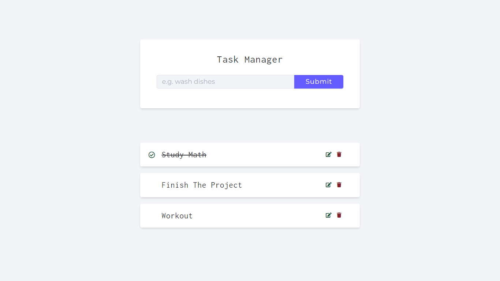
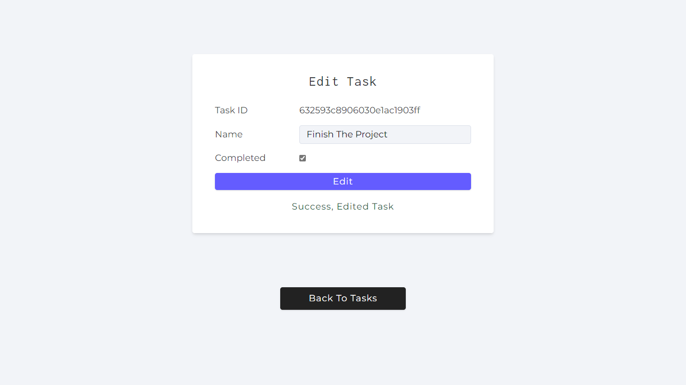

# Task Manager

Task manger built with Express.js & MongoDB

## Demo

## HTTP Methods

- Get all tasks &nbsp; &nbsp; `GET /api/v1/tasks`
- Create task &nbsp;&nbsp; &nbsp; `POST /api/v1/tasks`
- Get task &nbsp; &nbsp; &nbsp; &nbsp; &nbsp; `GET /api/v1/tasks/:id`
- Update task &nbsp; &nbsp; `PATCH /api/v1/tasks/:id`
- Delete task &nbsp; &nbsp; &nbsp; `DELETE /api/v1/tasks/:id`
